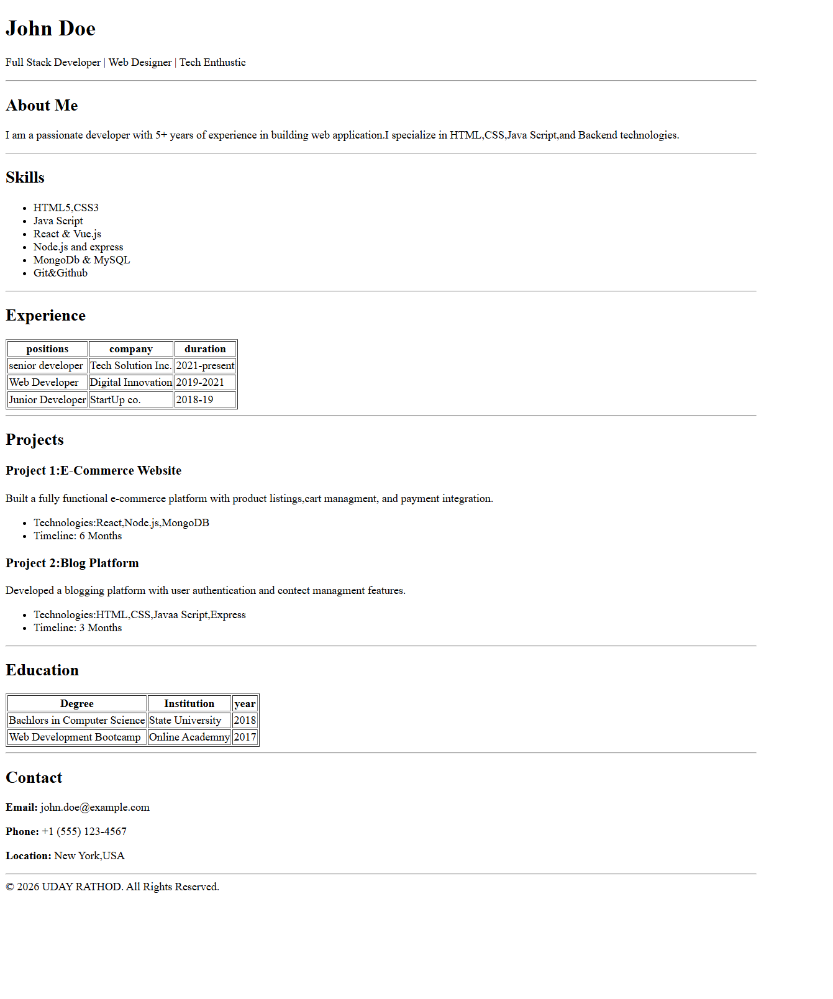

# Semantic Resume (HTML) – Cohort Assignment

## Assignment Overview

This assignment required building a **personal resume webpage using pure HTML** that focuses on:

* Semantic structure
* Accessibility best practices
* Clear content organization

The resume represents a **Full Stack Developer profile** and demonstrates proper use of HTML elements to structure real-world resume content.

---

## How to Setup

1. Download or clone the repository
2. Open the `index.html` file in any modern browser

No additional setup, libraries, or installations required.

---

## What’s Covered in My Submission

### Semantic HTML Structure

The page is organized using meaningful HTML tags instead of generic `
` elements:

* `<header>` → Resume heading and title
* `<main>` → Main resume content
* `<section>` → Individual resume areas
* `<article>` → Project details
* `<footer>` → Copyright information

Proper heading hierarchy is followed:
`<h1>` → `<h2>` → `<h3>`

---

### Resume Sections Included

My resume contains all major professional sections:

* **About Me** – Short professional summary
* **Skills** – Technical skillset
* **Experience** – Work history in table format
* **Projects** – Detailed project descriptions
* **Education** – Academic qualifications
* **Contact Information** – Email, phone, and location

---

### Accessibility Enhancements

Accessibility was implemented using best practices:

* `role="banner"` used for the header
* `scope="col"` used in tables for screen readers
* `aria-label` added for project articles
* Structured headings for navigation support
* Semantic layout for assistive technologies

---

### Tables & Data Representation

Two tables were used:

* **Experience Table** → Work history with role, company, duration
* **Education Table** → Degree, institution, and year

This ensures clear and structured presentation of information.

---

## Technologies Used

* HTML5 (Only — no CSS/JS frameworks)

---

## Screenshot

Add a screenshot of your webpage and name it `resume.png` in the repository.

---

## Author

**Uday Rathod**

© 2026 All Rights Reserved
